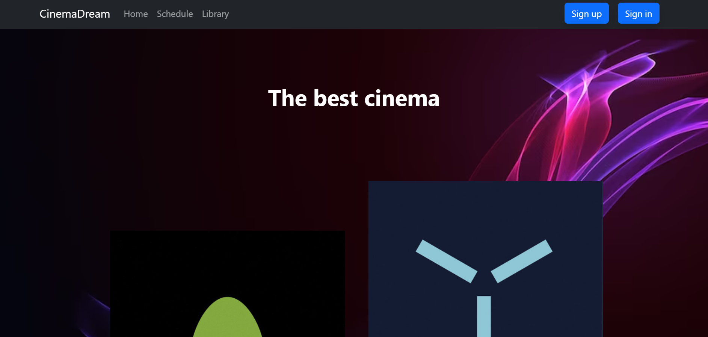

job4j Cinema Service

Веб-Сервис киноотеатр, позволяющий пользователю покупать билеты на интересующий его сеанс, 
так же можно выбрать ряд и место. Пользоваться сайтом может любой пользователь, для покупки билета необходима регистрация.
На сайте есть несколько страниц, таких как:   
-Главная страница   
-Регистрация/вход  
-Расписания сеансов  
-Кинотека(список всех фильмов)  
-Страница покупки билетов  
-Страницы с результатом покупки билета

### Стек технологий:  
-Java 17  
-Spring Boot 2.7.6  
-Thymeleaf  
-Bootstrap  
-Liquibase  
-Sql2o 1.6.0  
-PostgreSQL 10  
-H2  
-Mockito
-Maven 3.1.2.

### Требования к окружению:  
Java 17, Maven 3.8, PostgreSQL 14;

### Запуск приложения:  
-клонировать проект  
-создать базу данных "cinema"  
-в папке проекта выпонить команду mvn spring-boot:run  
-в браузере перейти на страницу http://localhost:8080/  

# Взаимодействие с приложением:
1. Главная страница.  

2. Расписание фильмов.  

3. Описание/библиотека фильмов.  

4. Страница регистрации.  

5. Страница входа.  

6. Страница покупки билета, ряд и место можно выбрать, колличество рядов и мест в выпадающих списках, соотвествует залу.  

7. Страница успешной покупки. Сюда могут попасть только авторизированые пользователи.  

8. Страница неудачной покупки. Например, место уже куплено.

  
  
## ? Мои контакты
tg: @drinkinswo

Cinema Service  
